# Apartment rentals MVP
Working MVP for an apartment rentals management wesbite created using ASP.NET MVC Core and Angular. 
##	User registration and login
###	User login
The first screen of the web application is a login page with a link to the registration page and social login buttons for Google and Facebook login.  
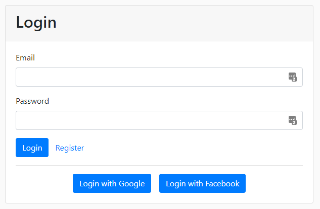

###	 User registration
Users can register by logging in with Facebook or Google. When a user signs in for the first time with Google or with Facebook a new account is created. Users can also choose to use the registration form to create their accounts.   
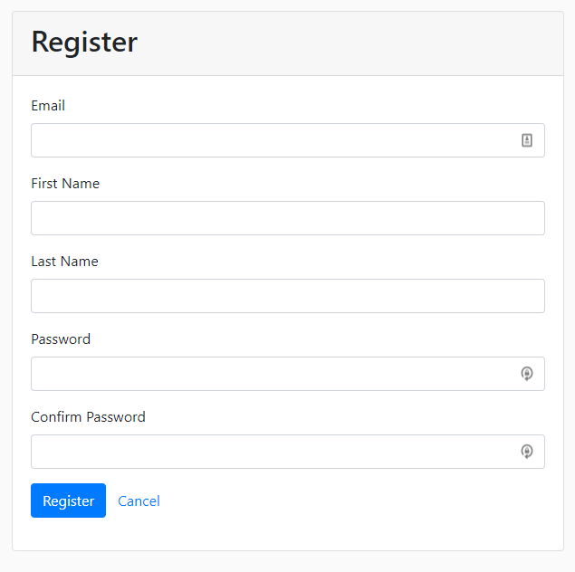

The registration form input is validated right away, and the validation errors are displayed bellow each field.  
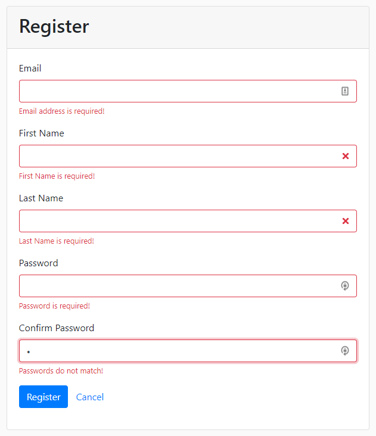
 

###	 Email confirmation
After registration an email is sent out by the system to let users confirm their email address.
After the user clicks the link in the email the following page is displayed where the actual confirmation takes place.  
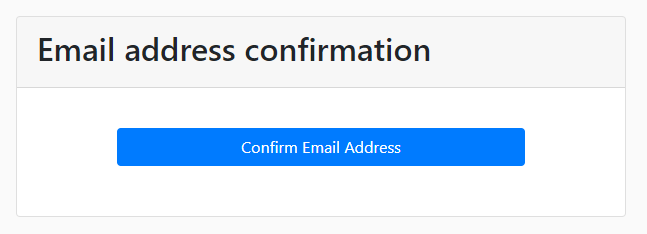  
If a user tries to log in before the email address is verified a validation error is shown with a button to request a new confirmation email to be sent:  
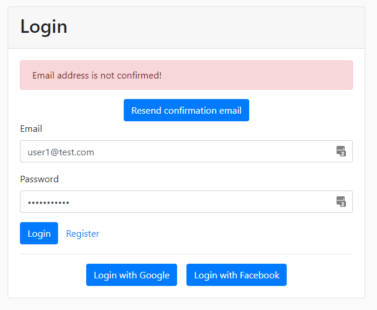 

###	 User lockout
After 3 consecutive failed login attempts users are automatically blocked out of the system. In this case the user needs to contact and administrator to have their account unblocked. When an administrator unblocks the account the user receives an email from the system with a link to reset their password.
 
If the user clicks the Reset password button, then the follow screen is displayed. Here the user can choose a new password for his account.  
   

###	 Clients and Realtors
Upon registration each user is first assigned the role of a client. Later, if the user wishes to switch his role and become a realtor, he can change his role by clicking the Become a Realtor button on the top navigation bar.
  
##	Main page
The main page contains the list of apartments that are available for renting. The list displays 5 entries at a time sorted by the date of the entry, starting from the newest apartment. The list can be navigated using the Prev and Next buttons at the bottom of the list. If there are no more previous or next pages the respective button will not show up.  
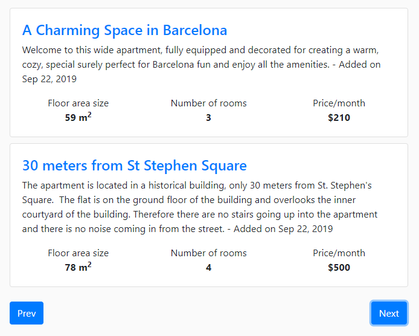 
 
The list can be filtered using the filter fields in the right sidebar. The filters are applied immediately using the Apply button.  
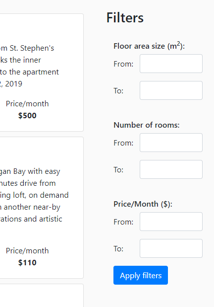    
 
This main page is displayed for all users, including Realtors and the Admin after login. In the top navigation bar, there are buttons to access the admin panel, the realtor dashboard and the Map view.
 
 
##	Map view
On the map view all the available apartments are shown on a map. The same filters can be applied as on the main page. When clicking on an apartment`s pinned location on the map a small summary window is displayed and from here users can navigate to the details page of the apartment.  
   
 
 
##	Apartment details 
When an apartment is selected from the list or from the map a details page will be displayed with a map showing the location of the apartment. Besides the apartment information, the apartment`s realtor information is also displayed on this page.    
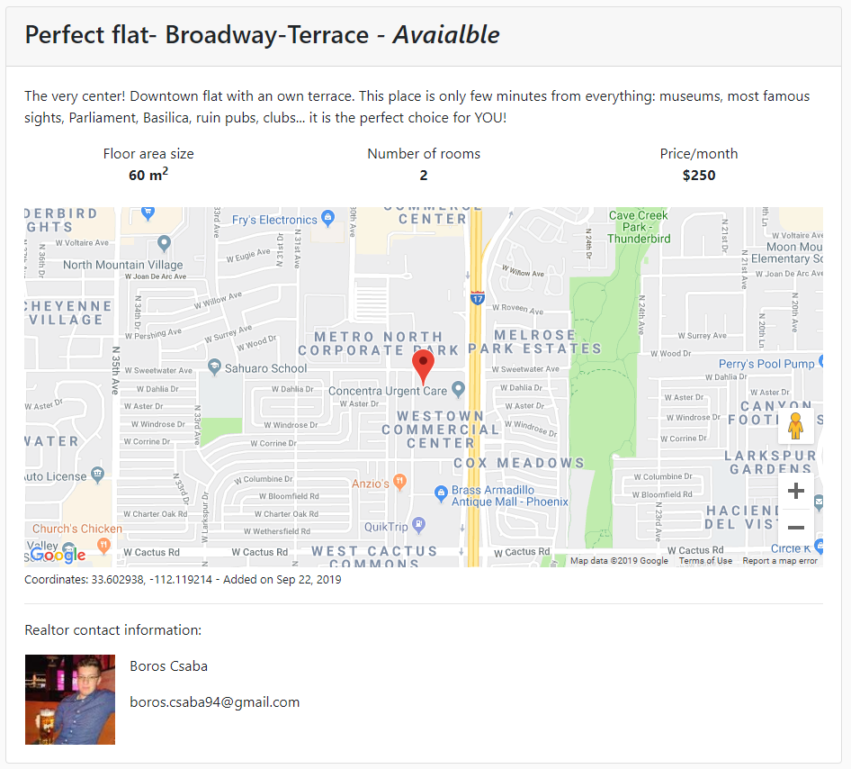  
 
##	Realtor dashboard
Realtors can edit and add new apartments using the realtor dashboard which can be access from the top toolbar. On this page realtors will be presented with a simplified, paginated list of the apartments they own. From this list they can edit or delete any entry.  
  
 
(The list will contain 15 entries/page, this image only contains 2 for brevity)
When a realtor clicks the Add new apartment button or the pencil icon next to one of the apartments, the apartment editor window is displayed.  
  

To make it easier for realtors to input the geocoordinates, the address field can be used to search for the latitude and longitude coordinates of a place based on its address.
The editor fields are validated on saving and the validation errors are displayed to help users identify the problems easier.  
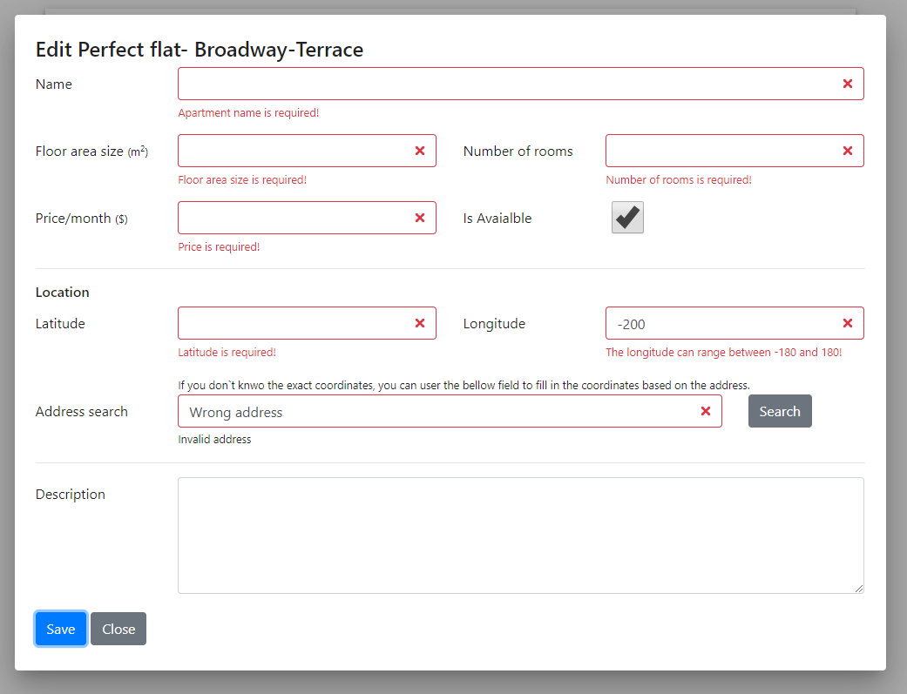   
 
##	User profile modifications
When the Edit profile button is clicked in the top navigation bar a popup is displayed where users can edit their names and profile pictures. When a user registers using Facebook or Google then the initial profile picture is downloaded from their external account, but later it can be changed in this editor.
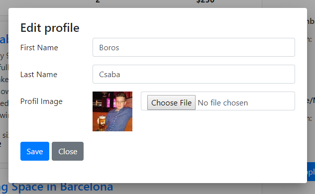   
 
##	Admin panel
The Admin panel consists of two pages. One view contains a paginated list of users and another the list of apartments. The admin is able to create/read/update and delete users and apartments, assign users into Roles, unblock blocked users and send email invitations to new users. 
###	 User management
On the admin panel a list of all the users from the system is displayed showing basic information about each user including it`s roles. This table shows the blocked user status as well.  
   
###	Removing user locks
In case of blocked users, a button with a key icon is displayed. Using this button, the administrator can unblock the account. In this case the user will receive an email with a link to reset his password, however it is not required for the user to change his password if he still remembers his old one.
###	Creating and editing users
The admin can create new users and edit existing users. A similar editor window is shown when editing a user and when creating a new one with the exception that the password cannot be edited in case of existing users.  
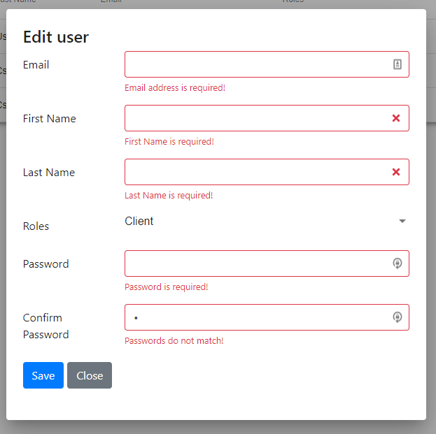  
 
###	User deletion
Admin users also have the possibility to delete existing users using the delete buttons in the users table. When a realtor user is deleted all the apartments that belong to that realtor are deleted as well.
###	User invitations
Admin users can invite new users to join the system by clicking the Invite new user button on the admin dashboard. After entering a valid email address and clicking the Send button an email message is sent with a link to the registration page. Invited users must register using the same workflow as regular new users.  
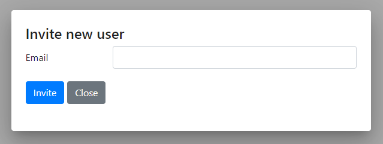  

###	Apartment management 
Administrators can see and manage all the apartments in the system. On the admin dashboard a similar list is displayed as on the realtor dashboard with the exception that this list contains each apartment from each realtor. The administrator can add new apartments, edit, and delete each existing apartment the same way that realtors can, except that admins can also assign apartments t other realtors as well.
